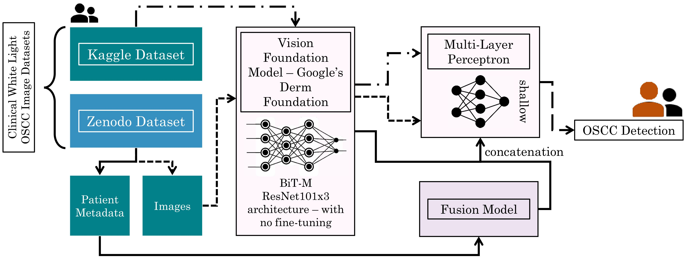

# DermFoundation_Inference
## Vision foundation models pre-trained on skin lesions can detect oral lesions too!

The repository contains the implementation of the following paper. \
\
Title - **Vision foundation models pre-trained on skin lesions can detect oral lesions too!** \
Authors -  Vedatroyee Pal, Rajarshi Bandyopadhyay, Samarup Bhattacharya, Sanjoy Kumar Saha, Tapabrata Chakrabarti
DOI - Under peer review

## Abstract
Recognizing the critical limitations imposed by data scarcity in Oral Squamous Cell Carcinoma (OSCC) detection, this work demonstrates how the unprecedented transferability of Vision Foundation Models (VFMs) provides a powerful solution. We present the first work to employ a VFM, Google’s Derm Foundation, pretrained on dermatology images, as a frozen feature extractor for OSCC detection. By training only a shallow Multi-Layer Perceptron (MLP) classifier, we achieve high-performance with minimal computational load. This lightweight pipeline, validated across multiple datasets, offers robust performance comparable to fully trained Convolutional Neural Networks (CNNs), establishing an efficient paradigm for early screening in resource-constrained environments.
\
\
\



# Data
The two datasets used in this paper are available at the following links. Of these, the first dataset is publicly available and hosted on Kaggle while the second dataset has not been made public and has been made available to us for this study by special permission from the authors of this dataset:
1. [Oral Cancer (Lips and Tongue) Images](https://www.kaggle.com/datasets/shivam17299/oral-cancer-lips-and-tongue-images)
2. [Dataset of Annotated Oral Cavity Images for Oral Cancer Detection](https://zenodo.org/records/10664056)


# Getting started

## Installation
To install all requirements execute the following line.
```bash
pip install -r requirements.txt 
```
And then clone the repository as follows. 
```bash
git clone https://github.com/SamarupBhattacharya/DermFoundation_Inference.git
```

## Data

The folder **Data** contains numpy files containing the embeddings generated for the images with the help of Google's Derm Foundation model along with the ground truth labels for the images and CSV files containing additional information for the images as well as for the patients.
1. dataset_1_embeddings.npy - Contains a numpy array of 6144-dimensional embeddings for all the images in the dataset 1
2. dataset_1_labels.npy - Contains a numpy array of labels for the images in the dataset 1
3. dataset_2_embeddings.npy - Contains a numpy array of 6144-dimensional embeddings for all the images in the dataset 2(as well as certain augmentations for the images and have not been utilized for this paper)
4. dataset_2_labels.npy - Contains a numpy array of labels for the images in the dataset 2(the 748 labels at the end correspond to the augmentations of the images and have not been utilized for this paper)
5. Imagewise_Data.csv - Contains image-level information for the images in the dataset 2 such as Image Name, Category, Clinical Diagnosis, Lesion Annotation Count.
6. Patientwise_Data.csv - Contains patient-level information for the images in the dataset 2 including Patient ID, Age, Gender, Smoking, Chewing_Betel_Quid, Alcohol, Image Count


## Saved Models
The folder **Checkpoints** contains the saved checkpoints for each of the five folds used for cross validation and for each of the three modes explored. In order to replicate the performance claimed in our paper, these checkpoints will find use.
Note: We used Kaggle's P100 GPU for training and evaluating the model, and therefore to replicate our performance, the reader is humbly requested to use the same.

### Training/Testing
To train/test DermFoundation_Inference execute the following.
```bash
python main.py --checkpoint_dir CHECKPOINT_DIRECTORY_PATH --data_dir DATA_DIRECTORY_PATH --mode MODE --inference_only WHETHER_INFERENCE_ONLY_MODE_IS_DESIRED
```
Here:

- checkpoint_dir: Requires the path of the checkpoint directory i.e. path to the directory where the contents of the "Checkpoints" directory have been downloaded and saved
- data_dir:  Requires the path of the checkpoint directory i.e. path to the directory where the contents of the "Data" directory have been downloaded and saved
- mode: Three modes are supported by the training/testing code
  - unimodal: Only the images are used to train/test the MLP Classifier
  - multimodal_all_features: All five columns of the patient-level metadata are used for training/testing the Fusion Model Classifier in conjunction with the embeddings of the images
  - multimodal_best_features: The two most important columns of features from the patient-level metadata(determined with the help of XGBoost) are used for training/testing the Fusion Model Classifier in conjunction with the embeddings of the images
- inference_only: Requires one of the following as input:
  - yes: Model is used for inference only using the checkpoints saved in "Checkpoints" directory
  - no: Model is trained first and then inference is performed


## Notebooks
This directory contains the Kaggle notebooks that were used for model training and evaluation.


# Acknowledgement 


# Citation
```bash

```

```bash

```
