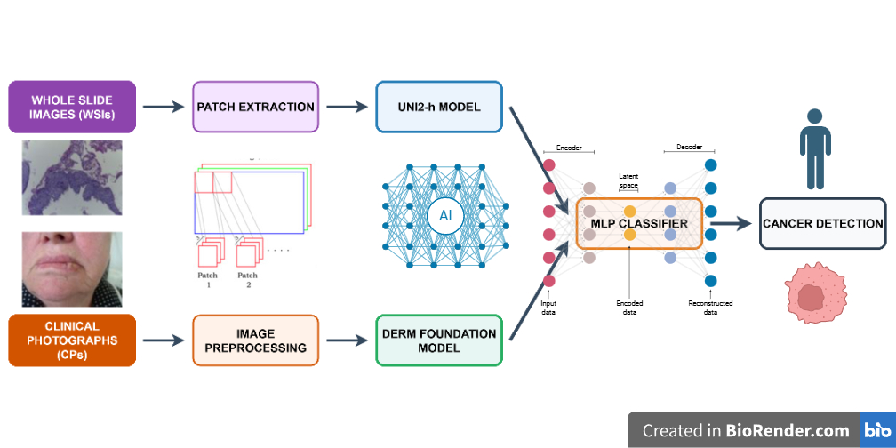

# DermFoundation_Inference
## Vision foundation models pre-trained on skin lesions can detect oral lesions too!

The repository contains the implementation of the following paper. \
\
Title - **Vision foundation models pre-trained on skin lesions can detect oral lesions too!** \
Authors -  \
DOI - 

## Abstract
While there exist large public image datasets for skin cancer (more common in the global north), there only exist a couple of small public datasets for oral cancer (more common the global south), thus potentially indicating a hidden bias from the point of view of AI fairness and benchmarking machine learning models. While there has been some work using convolutional neural network (CNN) models on these smaller oral cancer datasets, it has not been possible yet to train a state-of-the-art large vision transformer (ViT) based foundation model on oral cancer yet due to data scarcity. For the first time, in this paper, it is demonstrated that a vision transformer model trained on skin lesion images (Google DermFoundation) can be used directly as backbone feature embedders without any retraining or tuning for robust feature representation on oral lesion images. 
\
  </img>


# Data
The two datasets used in this paper are available at the following links. Of these, the first dataset is publicly available and hosted on Kaggle while the second dataset has not been made public and has been made available to us for this study by special permission from the authors of this dataset:
1. [Oral Cancer (Lips and Tongue) Images](https://www.kaggle.com/datasets/shivam17299/oral-cancer-lips-and-tongue-images)
2. [Dataset of Annotated Oral Cavity Images for Oral Cancer Detection](https://zenodo.org/records/10664056)


# Getting started

## Installation
To install all requirements execute the following line.
```bash
pip install -r requirements.txt 
```
And then clone the repository as follows. 
```bash
git clone https://github.com/Samarup-Bhattacharya/DermFoundation_Inference.git
```

## Data processing

The folder **Data** contains numpy files containing the embeddings generated for the images with the help of Google's Derm Foundation model along with the ground truth labels for the images and CSV files containing additional information for the images as well as for the patients.
1. signatures.csv - The details of the gene groups.
2. org_minmax_scaler - The trained min-max scalers to normalise the transcriptomic data.


## Synthesizing transcriptomic data from histopathology images
The folder **PathGen** contains the code to synthesize transcriptomic features from whole slide images using our novel diffusion-based model PathGen. The checkpoints for the trained models can be downloaded from [here](https://drive.google.com/drive/folders/1vGwPY9WA81F_tDke4mMjKHAjiPtwBdd3?usp=sharing). 

### Training
To train PathGen execute the following.
```bash
python3 PathGen/main.py --data_root_dir PROCESSED_DATA_PATH --results_dir RESULT_DIRECTORY_PATH --max_epochs NUMBER_OF_EPOCHS
```
To resume training from an intermediate epoch execute the following.
```bash
python3 PathGen/main.py --data_root_dir PROCESSED_DATA_PATH --results_dir RESULT_DIRECTORY_PATH --max_epochs NUMBER_OF_EPOCHS --weight_path PATH_OF_WEIGHT_TO_LOAD --start_epoch START_EPOCH_NUMBER
```

### Inference
To run inference execute the following.
```bash
python3 PathGen/main.py --data_root_dir PROCESSED_DATA_PATH --results_dir RESULT_DIRECTORY_PATH --weight_path PATH_OF_WEIGHT_TO_LOAD --op_mode test
```


## Gradation and Survival Risk Estimation
The folder **MCAT_GR** contains the code for gradation and survival risk estimation using synthesised transcriptomic data obtained using PathGen. The checkpoints for the trained models can be downloaded from [here](https://drive.google.com/drive/folders/1EQTALaJmpReP5n_86SSkUnVcuJdTtVQO?usp=sharing).

### Training using real transcriptomic data
To train the model using real transcriptomic data execute the following.
```bash
python3 MCAT_GR/main.py --data_root_dir PROCESSED_DATA_PATH --results_dir RESULT_DIRECTORY_PATH --max_epochs NUMBER_OF_EPOCHS --data_type real --op_mode train —n_timebin NUMBER_OF_SURVIVAL_TIME_BINS --n_grade NUMBER_OF_GRADES
```

To resume training from an intermediate epoch, execute the following.
```bash
python3 MCAT_GR/main.py --data_root_dir PROCESSED_DATA_PATH --results_dir RESULT_DIRECTORY_PATH --max_epochs NUMBER_OF_EPOCHS --data_type real —op_mode train --best_weight_path PATH_OF_WEIGHT_TO_LOAD --start_epoch START_EPOCH_NUMBER —n_timebin NUMBER_OF_SURVIVAL_TIME_BINS --n_grade NUMBER_OF_GRADES
```

### Inference using synthesized transcriptomic data
To perform inference using synthesised transcriptomic data execute the following.
```bash
python3 MCAT_GR/main.py --data_root_dir PROCESSED_DATA_PATH --results_dir RESULT_DIRECTORY_PATH  --data_type syn --op_mode test --best_weight_path PATH_OF_BEST_WEIGHT --test_syn_path PATH_TO_SYNTHESIZED_TRANSCRIPTOMES —n_timebin NUMBER_OF_SURVIVAL_TIME_BINS --n_grade NUMBER_OF_GRADES
```

To perform distributed inference using synthesised transcriptomic data execute the following.
```bash
python3 MCAT_GR/main.py --data_root_dir PROCESSED_DATA_PATH --results_dir RESULT_DIRECTORY_PATH  --data_type syn --op_mode test --best_weight_path PATH_OF_BEST_WEIGHT --test_syn_path PATH_TO_SYNTHESIZED_TRANSCRIPTOMES —n_timebin NUMBER_OF_SURVIVAL_TIME_BINS --n_grade NUMBER_OF_GRADES --test_type distributed
```

### Calibration and uncertainty estimation
Execute the following to perform calibration using synthesised transcriptomic data and uncertainty estimation using synthesised transcriptomic data.
```bash
python3 MCAT_GR/main.py --data_root_dir PROCESSED_DATA_PATH --results_dir RESULT_DIRECTORY_PATH  --data_type syn --op_mode calibrate --best_weight_path PATH_OF_BEST_WEIGHT --test_syn_path PATH_TO_SYNTHESIZED_TRANSCRIPTOMES —n_timebin NUMBER_OF_SURVIVAL_TIME_BINS --n_grade NUMBER_OF_GRADES
```


# Acknowledgement 


# Citation
```bash

```

```bash

```